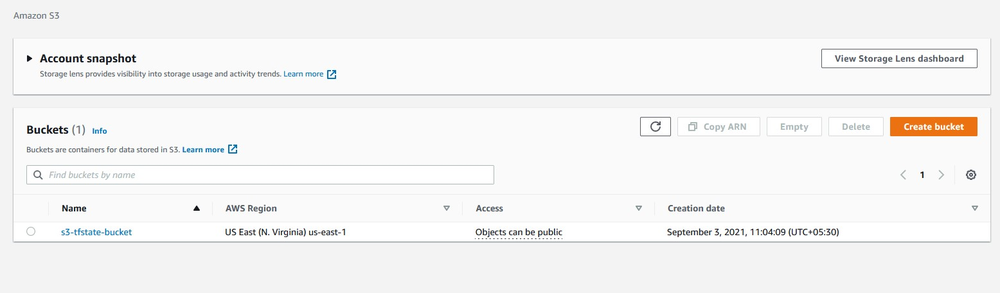
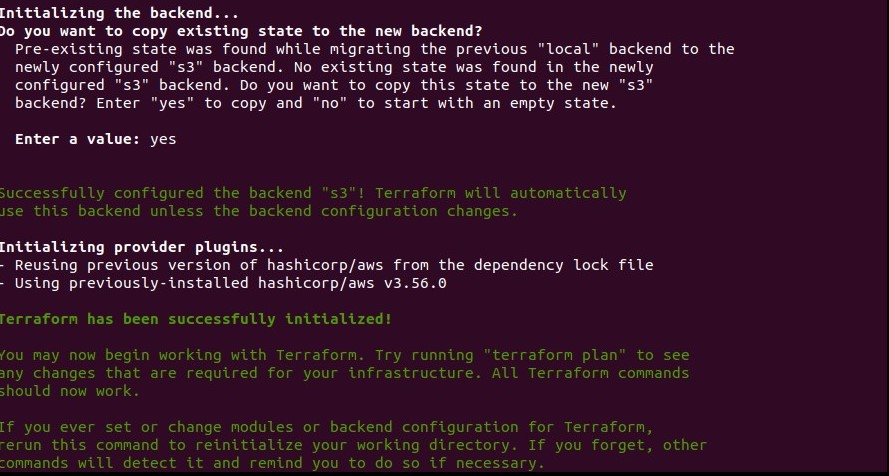
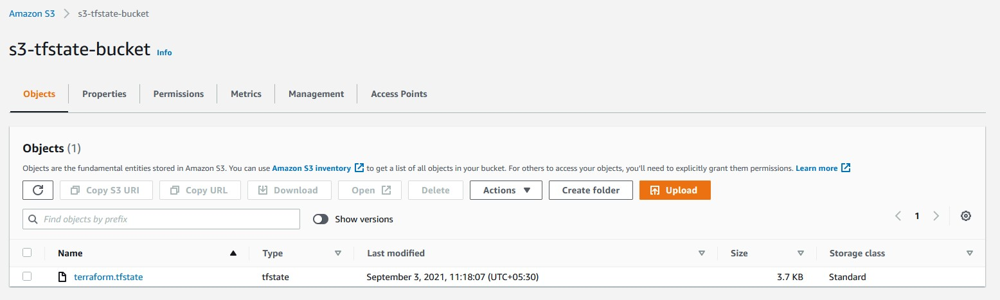

# Terraform-S3-bucket

Terraform stores state file locally in a file named terraform.tfstate. When working with Terraform in a team, use of a local file makes Terraform usage complicated because each user must make sure they always have the latest state file data before running terraform apply and make sure that nobody else runs terraform apply at the same time.

With remote state, Terraform writes the state data to a remote data store, which can then be shared between all members of a team. Terraform supports storing state in variety of backends. we are now going to use AWS S3 as our backend to configure our remote state.


### Pre-requisites for this project

-  Need to have S3 bucket created
-  IAM User with S3 Admin access
-  IAM User with Privilege to access s3 bucket

The Following policy will allow an exisiting IAM user to get access to S3 Bucket.

```sh

{
  "Version": "2012-10-17",
  "Statement": [
    {
      "Effect": "Allow",
      "Action": "s3:ListBucket",
      "Resource": "arn:aws:s3:::mybucket"
    },
    {
      "Effect": "Allow",
      "Action": ["s3:GetObject", "s3:PutObject"],
      "Resource": "arn:aws:s3:::mybucket/path/to/my/key"
    }
  ]
}

```

### S3 Bucket

I have already created an S3 bucket with versioning enabled.



### Creating Backend

We now add the following code to our main.tf file (or any other)terraform file in our working directory

```sh
terraform {
  backend "s3" {
    bucket = "your-bucket-name"
    key    = "network/terraform.state"
    region = "provide-your-region"
    access_key = "provide-your-access-key"
    secret_key = "provide-your-secret-key"
  }
}
```

We have to provide bucket name and the key which is the location where the state file will be kept, After providing the necessary details we now move to initialize our backend with the following command.

```sh
terraform init
```
- _Screenshot_




As there was a pre existing terraform state file, terraform will now copy our state file to our backend S3 bucket.

Now lets validate the terraform files using the following command

```sh
terraform validate
```

To create and plan the architecture using the following command

```sh
terraform plan
```

Applying and executing the plan

```sh
terraform apply
```

Further checking on our S3 bucket we could see that the tfstate file has appeared in it.




When we check our local directory we could see that the tf state file in the local directory has become empty

```sh
taj@ubuntu:~$ ls -l
-rw-rw-r-- 1 taj taj    0 Sep 2 23:37 terraform.tfstate
```

### Conclusion
We successfully created an S3 backend to store our statefile thereby making it easier to manage and secure.

